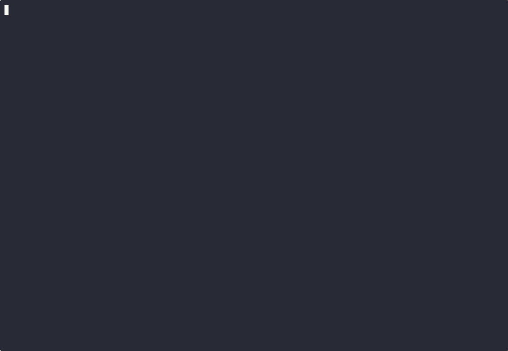
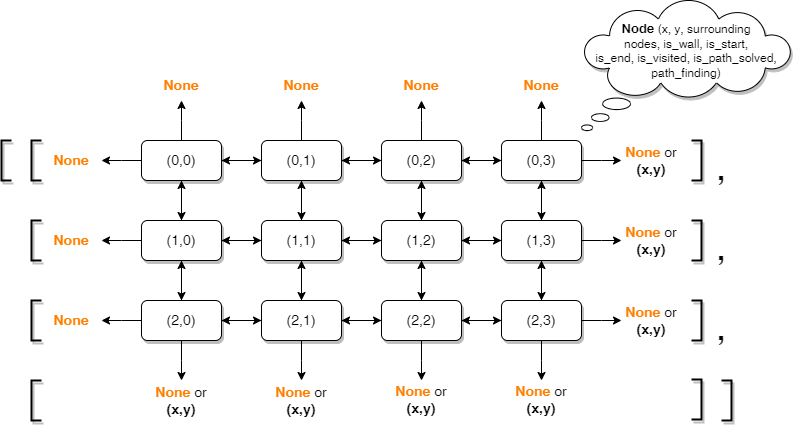
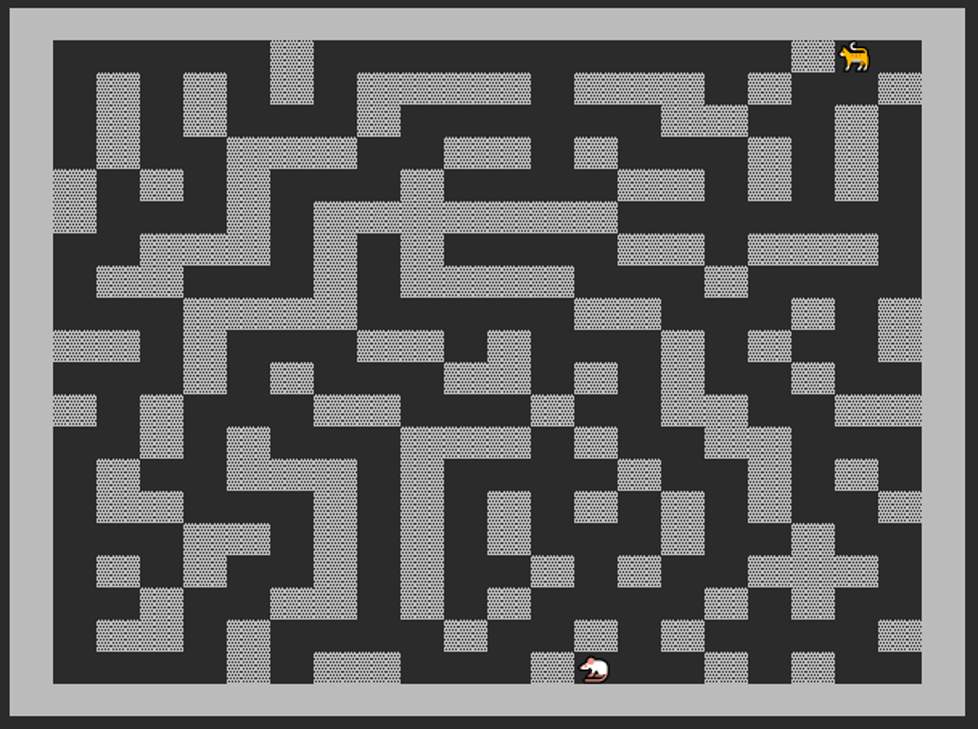
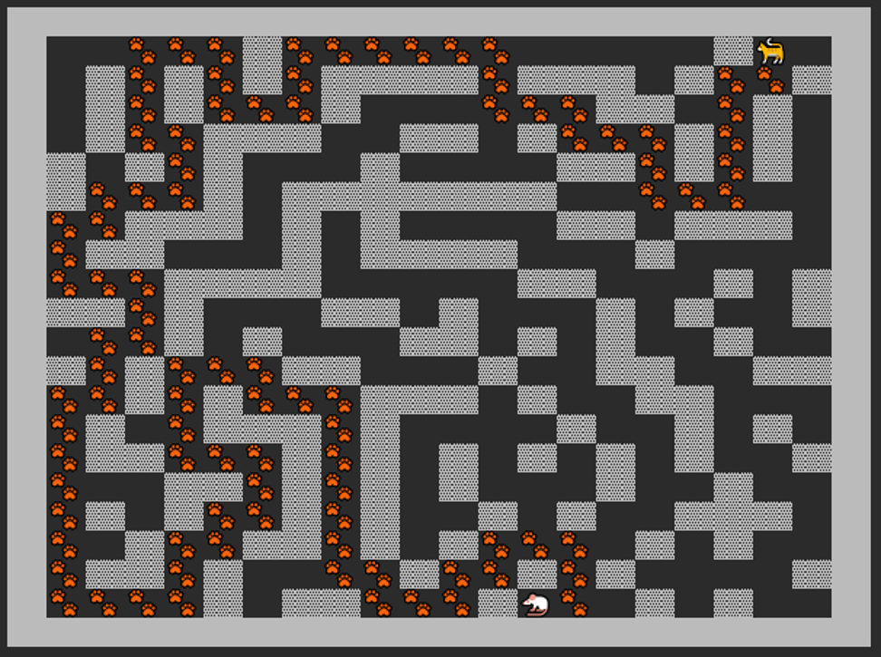

# MazePlayground



Ein kleines Python-Projekt zur Erzeugung und Lösung von zufälligen Labyrinthen. Hierbei können die Labyrinthgröße (Länge, Breite) und der Verzweigungsfaktor geändert werden. Zur Erzeugung der Labyrinthe wurden der rekursive Backtracking-Algorithmus (Tiefensuche) und ein Verzweigungsfaktor (Wahrscheinlichkeit, den aktuellen Pfad zu unterbrechen und zu einem zuvor besuchten Knoten zurückzuspringen, um von dort aus fortzufahren) verwendet. Das generierte Labyrinth wird in der Konsole visualisiert. Im zweiten Teil wird der kürzeste Weg durch das Labyrinth vom Start zum Ziel durch ein Breitensuchalgorithmus gesucht. Das gelöste Labyrinth wird auch in der Konsole visualisiert.

### Kurze Anleitung

- Voraussetzungen: Python 3.9+ und `pip`.
- Abhängigkeiten installieren:

```bash
pip install -r requirements.txt
```

-- Hauptprogramm starten:

```bash
python mazeplayground.py
```


### Inhalt

- `mazeplayground.py` – Entrypoint (interaktive Ausführung).
- `Functions_Maze.py` – Logik zur Erzeugung/Lösung und Darstellung.
- `Node.py` – Datenstruktur für Knoten/Zellen.


### Datenstruktur der Klasse Node




### Maze Generator
Katze = Start, Maus = Ziel




### Maze Solver
Katze = Start, Maus = Ziel




### To-Do's für die Zukunft
- Erstellung von PDFs, Speichern von Labyrinthen
- mehrere Ebenen hinzufügen (3D-Labyrinthe)
- andere Algorithmen zur Generierung der Labyrinthe implementieren (und Möglichkeit der Auswahl des Algorithmus)


### Lizenz

Dieses Projekt steht unter der Creative Commons Attribution 4.0 International (CC BY 4.0). Siehe `LICENSE` für Details.


